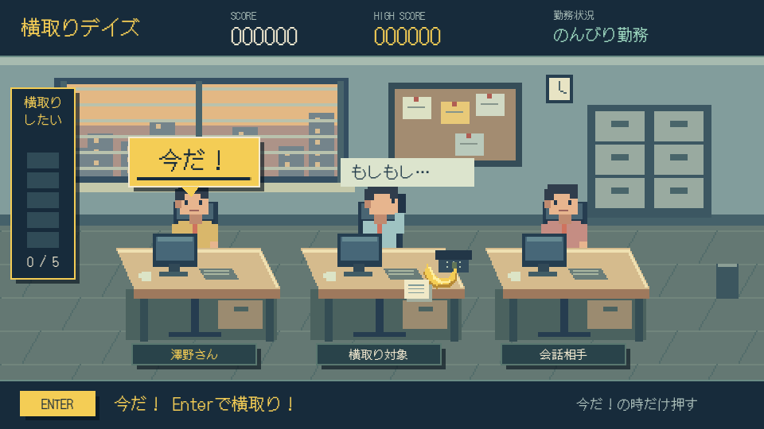

# 澤野さんの横取りデイズ
## ～お前の仕事は俺の仕事～

Godot 4.5.1 / GDScript / 2D。見つかるまで続くワンボタン・スコアアタックです。
同僚が電話や右隣との会話に気を取られたら、仕事とバナナを横取りします。

公開版：<https://badgio0906.github.io/yokodori-days/>



## すぐ遊ぶ

- **Windows**：`build/windows/YokodoriDays.exe` をダブルクリック。Godotのインストールは不要です。
- **Godot Editor**：Godot **4.5.1 stable** で `project.godot` をインポートし、F6ではなく **F5**（プロジェクト実行）を押します。
- **Web**：下のローカルサーバーを起動し、`http://127.0.0.1:8765/` を開きます。`index.html` を直接ダブルクリックする `file://` 起動には対応しません。

Python 3 がある場合、プロジェクトのフォルダで：

```powershell
python tools/serve_web.py
```

自動的にブラウザを開きます。終了はサーバーのターミナルで Ctrl+C。8765番を使用中なら `python tools/serve_web.py 8766` とします。Pythonがない場合はGodot EditorのWebリモートデバッグでも起動できます。

この制作環境では以下のPythonも利用できます：

```powershell
& "$env:USERPROFILE\.cache\codex-runtimes\codex-primary-runtime\dependencies\python\python.exe" tools/serve_web.py
```

## 操作

使うキーは **Enterのみ**。テンキーEnterも対応しています。

| 画面・状態 | Enterの動作 |
|---|---|
| タイトル | 開始 |
| 「今だ！」表示中 | 横取り成功 |
| それ以外 | 見つかってゲームオーバー |
| ゲームオーバー | 即座に再挑戦 |

成功直後0.20秒は入力を受け付けません。1チャンスにつき1回だけ加点し、その後は次の「今だ！」を待ちます。押しっぱなし・キーリピートでは連続入力しません。

## 実装済み

- タイトル、ランダムな通常勤務・電話・会話、独立した安全時間、残り時間付き「今だ！」。
- 仕事 +100点、バナナ追加 +300点（合計400点）。バナナ出現率25%。
- 手を伸ばすポーズ、書類が机へ飛ぶ演出、書類の蓄積、バナナの弧を描く移動・喜びポーズ・粒子・専用SE。
- 発見時の演出、落ち込んだ澤野さん、指定された左遷メッセージ、今回と最高のスコア、NEW RECORD!。
- `user://high_score.cfg` への最高スコア保存。加点直後に保存するため、途中終了時にも記録を残します。
- エンドレス進行、スコアに応じた連続的な難易度上昇、5種の合成SE。
- 960×540、Nearest、整数拡大、Compatibilityレンダラー。画面が小さい場合は縮小表示されます。
- Web（スレッド不使用）およびWindows x86_64のExportプリセットと実際のビルド。

## シーンとファイル構成

```text
project.godot                 プロジェクト設定・Input Map
export_presets.cfg            Web / Windows Desktop
scenes/
  Main.tscn                  入力と画面切り替え
  TitleScreen.tscn
  Game.tscn                  オフィス、人物、HUD、AudioStreamPlayer
  GameOver.tscn
  characters/
    Sawano.tscn
    TargetCoworker.tscn       独立した同僚のステートマシン
    Coworker.tscn
  ui/
    HUD.tscn
    ChanceBubble.tscn
    ScorePopup.tscn
scripts/
  main.gd                    Enterの状態別ルーティング
  game_manager.gd            GameState、スコア、発見演出、SE
  target_coworker.gd          WORKING / PHONE / TALKING / RETURNING
  character_visual.gd        SpriteFramesによる共通ポーズ切り替え
  sawano.gd                  成功と喜びのポーズ
  difficulty_manager.gd      難易度カーブ
  high_score_manager.gd      ConfigFileで保存・読み込み
  ui_canvas.gd               フォント・UIの共通描画
  title_screen.gd / game_over.gd / hud.gd
  chance_bubble.gd / score_popup.gd
assets/
  characters/                人物PNG
  office/                    背景・机PNG
  items/                     書類・電話・バナナPNG
  ui/                        追加UI素材の配置先
  audio/                     差し替え可能な5種のWAV
  fonts/                     DotGothic16とOFLライセンス
tests/                       ゲーム進行テスト・画面キャプチャ
tools/                       ローカルWebサーバー・仮素材生成元
docs/                        スクリーンショット・検証結果
build/web/                   配信用Webファイル一式
build/windows/               Windows実行ファイル
```

`Main` は `GameManager.GameState` を参照して入力を振り分けます。中央の同僚が発する `task_stolen` / `banana_stolen` / `caught_player` などのシグナルをGameManagerが受信します。`can_be_stolen` が成功条件と吹き出しの共通の根拠です。

## スコア・確率の変更

| 値 | 変更場所 | 初期値 |
|---|---|---:|
| `TASK_SCORE` | `scripts/game_manager.gd` | 100 |
| `BANANA_SCORE` | `scripts/game_manager.gd` | 300 |
| `BANANA_CHANCE` | `scripts/target_coworker.gd` | 0.25 |
| `banana_chance` | TargetCoworkerのInspectorでも変更可 | 0.25 |
| `INPUT_LOCK_SECONDS` | `scripts/game_manager.gd` | 0.20秒 |

バナナは通常勤務に入るごとに抽選します。Inspectorの`banana_chance`で上書きした場合は定数よりそちらを優先します。点数を変えるとタイトルと加点ポップアップにも反映されます。

## 難易度・安全時間の変更

実際のプレイでは `scripts/difficulty_manager.gd` の `settings(score)` が同僚のパラメータを更新します。ゲーム全体の調整はこのファイルで行ってください。

| パラメータ | 開始時 | 高得点時の下限 |
|---|---:|---:|
| `min_work_time` | 2.0秒 | 0.7秒 |
| `max_work_time` | 4.0秒 | 1.6秒 |
| `safe_window` | 1.40秒 | 0.42秒 |
| `distraction_duration` | 2.10秒 | 0.95秒 |

難易度は `1 - exp(-score / DIFFICULTY_SCORE_SCALE)` で滑らかに変化します。**`DIFFICULTY_SCORE_SCALE = 2400.0`** を大きくすると難しくなるのが遅く、小さくすると速くなります。500 / 1500 / 3000点ではHUDの勤務状況名が変わりますが、難易度自体には急な段差を設けていません。

`TargetCoworker` にもInspector用の同名変数がありますが、通常のゲーム開始・加点時に上記の難易度設定で更新されます。イベント開始時に安全時間とアニメーション時間を別々に保持するため、横取り直後の難易度更新で進行中のイベント時間が飛ぶことはありません。安全時間後はRETURNINGに入り、少なくとも0.25秒の戻り動作を確保します。

## 画像・音源の差し替え

現在の人物・オフィス・小物は**今回作成した仮ドット絵**です。添付参照画像そのものは作業フォルダに見当たらなかったため、文章指定をもとにオリジナルのオフィスを用意しました。

同じ名前・サイズのPNGを上書きすれば、Godotが再インポートします。ゲームの判定コードを書き換える必要はありません。

| 優先 | 差し替える画像 | サイズ・補足 |
|---|---|---|
| 1 | `characters/sawano_working.png` | 48×64、通常勤務 |
| 1 | `characters/sawano_steal.png` | 48×64、横取り・タイトル |
| 1 | `characters/sawano_happy.png` | 48×64、バナナ成功 |
| 1 | `characters/sawano_sad.png` | 48×64、発見・結果画面 |
| 1 | `characters/target_working.png` | 48×64、通常・振り向き |
| 1 | `characters/target_phone.png` | 48×64、右向きの電話 |
| 1 | `characters/target_talk.png` | 48×64、右隣との会話 |
| 1 | `characters/target_caught.png` | 48×64、左側を見る発見ポーズ |
| 2 | `characters/coworker_working.png` | 48×64、右の同僚の通常勤務 |
| 2 | `characters/coworker_talk.png` | 48×64、会話時に左右反転して表示 |
| 2 | `office/background.png` | 480×270、2倍表示 |
| 2 | `office/desks.png` | 480×270、透明背景、前景の机とPC |
| 2 | `items/banana.png` | 24×20 |
| 2 | `items/task.png` | 24×20 |
| 2 | `items/phone.png` | 24×20 |

その他の人物ポーズPNGは拡張用の予備です。各人物Sceneの`Sprite` → `SpriteFrames`にフレームを追加し、`working` / `phone` / `talk` / `caught` / `steal` / `happy` / `sad` のアニメーション名を維持すれば差し替えできます。複数フレームを追加すると、そのポーズの表示中にInspectorで設定した速度で再生します。

背景や人物の位置・拡大率は `Game.tscn` で調整できます。書類・バナナ演出の位置は `game_manager.gd` の `_draw()`、UIレイアウトは各画面のスクリプトで調整します。吹き出し・枠線はコード描画、フォントは共通の `ui_canvas.gd` と演出用の `game_manager.gd` の `FONT` で交換できます。

SEは `assets/audio/{phone_ring,steal_success,banana_get,caught,game_over}.wav` を差し替えるか、`Game.tscn` → `Audio` 以下の同名AudioStreamPlayerの`Stream`を変更します。現在はオリジナルの短い合成音です。音量は各PlayerのInspectorで調整できます。

`tools/generate_assets.py` は仮PNGとWAVの生成元です（Python + Pillow）。再実行すると仮素材を再生成するため、完成素材に差し替えた後は実行しないでください。`tools/generate_scenes.py` も初期Scene生成用であり、Sceneを編集後に再実行する必要はありません。

## Web Export

1. Godot 4.5.1と**同じバージョン**のExport Templatesをインストール。
2. `Project → Export` を開き、既存の **Web** プリセットを選択。
3. Compatibilityレンダラー・Thread Supportオフのまま、`build/web/index.html` にExport Project。
4. `build/web` の**ファイル一式**をHTTP(S)サーバーで配信。

コマンドラインでも書き出せます（`godot`がPATHにある場合）：

```powershell
godot --headless --path . --editor --import --quit
godot --headless --path . --export-release Web build/web/index.html
godot --headless --path . --export-release "Windows Desktop" build/windows/YokodoriDays.exe
```

スレッド不使用のためCOOP/COEPヘッダーは不要です。WASMとWebGL 2が利用可能なデスクトップブラウザを想定しています。Web版の保存はGodotの`user://`経由でブラウザのIndexedDBに保存され、同じサイトのURL・ブラウザプロファイルで保持されます。プライベートモードやサイトデータ削除時には保持されない場合があります。Windows版とWeb版の記録は別です。最初のEnter入力がブラウザの音声再生のユーザー操作にもなります。

Webファイルを公開サーバーへアップロードする作業は未実施です。納品物はローカル実行と静的配信に使用できます。

## 動作確認

```powershell
godot --headless --path . --script tests/test_game.gd
```

27項目の進行・入力・保存・確率・難易度テストです。プレイヤーの保存データとは別のテスト用ファイルを使用します。詳細は `docs/verification.md` を参照してください。

スクリーンショットは `godot --path . --script tests/capture.gd` で再取得できます。通常描画が必要なためheadlessは付けません。

## フォントとライセンス

DotGothic16（SIL Open Font License 1.1）を使用。ライセンス原文は `assets/fonts/OFL.txt` に同梱しています。出典：<https://github.com/google/fonts/tree/main/ofl/dotgothic16>。
ドット絵と効果音はこのプロジェクト用に生成したオリジナル素材です。

## 追加ルール（更新）

- **短いチャンス**：2〜4回に1回、安全時間を通常の65%に短縮。短縮率は `target_coworker.gd` の `short_window_scale`。通常・短いチャンスともに得点で短くなります。
- **10,000点を超えるとハイパー横取りタイム**：`difficulty_manager.gd` の `HYPER_THRESHOLD` / `HYPER_TIME_SCALE` で調整。通常勤務、安全時間、イベント全体、戻り動作を0.5倍にし、同じ得点・乱数条件の通常モードに対してチャンス頻度が2倍。10,000点ちょうどでは発動せず、次のイベントから反映します。安全時間は通常約0.22秒、短い回は約0.14秒です。
- **横取りしたいゲージ**：左側に表示。チャンスを見逃すと1目盛り増え、累計5回で自主退職のゲームオーバー。成功時は増えず、減少もしません。`game_manager.gd` の `MISSES_TO_QUIT` で上限を調整できます。
- **自主退職のセリフ**：指定どおり「横取りできなならこんな仕事辞める！」。`QUIT_LINE` で変更できます。誤入力による発見は従来の左遷メッセージのままです。
- **書類の山**：バナナ加点を含め100点につき1枚、机上に3列で積み重なります。描画は180枚まで、枚数表示はその後も増えます。
- **バナナの皮**：獲得1個につき1枚、澤野さんの机の左側へ蓄積。描画は60枚まで、個数表示はその後も増えます。
- 再挑戦ではゲージ・書類・皮・ハイパーモードを初期化します。
- 追加の差し替え素材：`assets/items/banana_peel.png`（24×20）、`assets/items/paper_stack.png`（30×8）。

新ルールのテストを `tests/test_game.gd` に追加しました。最新の結果は `docs/test-results.log`、追加画面は `docs/hyper.png` と `docs/quit.png` です。
